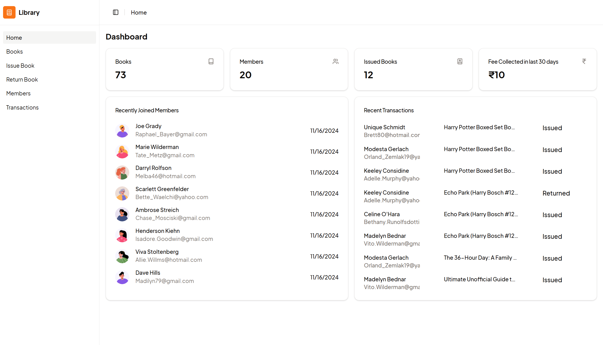
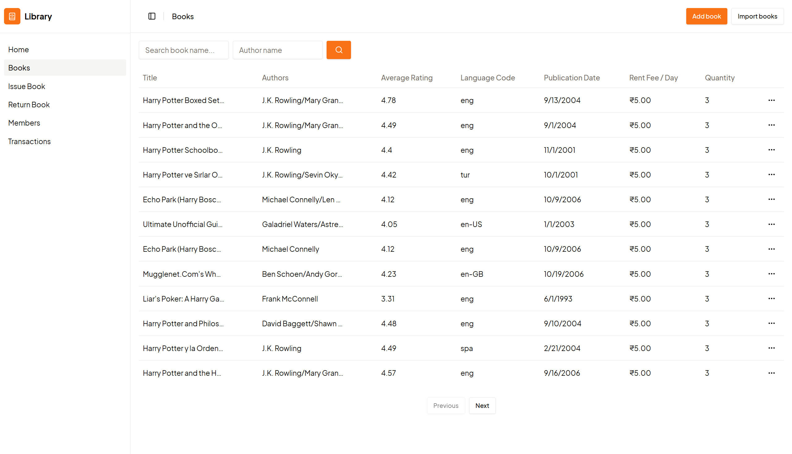
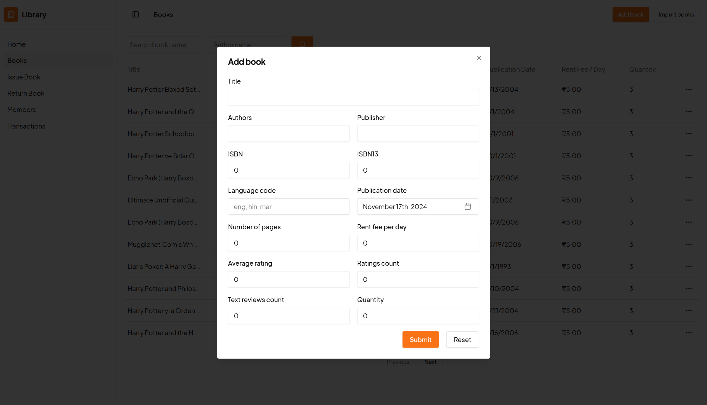
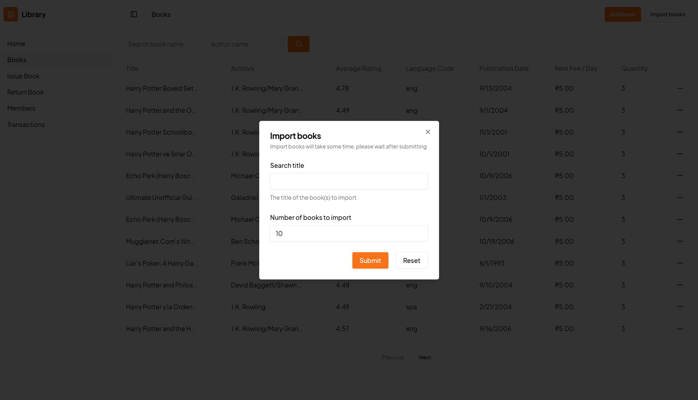
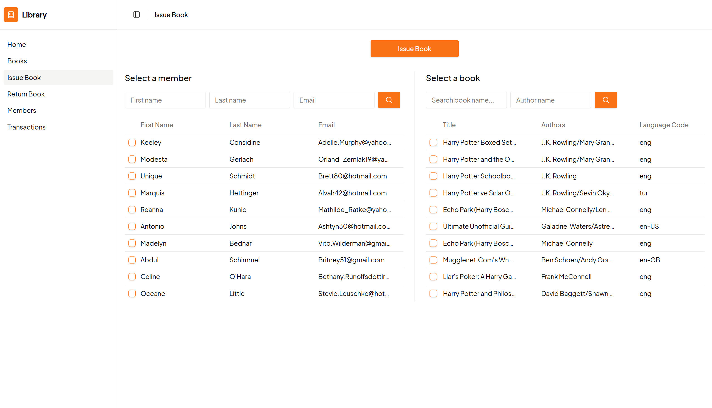
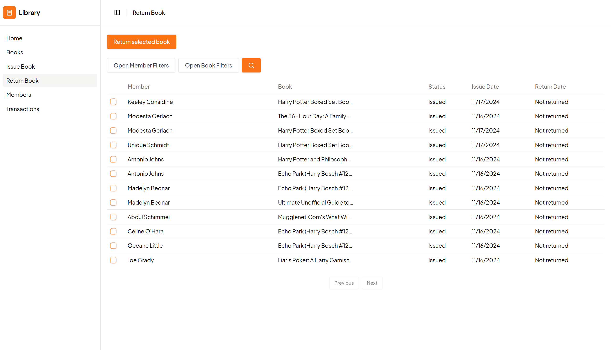
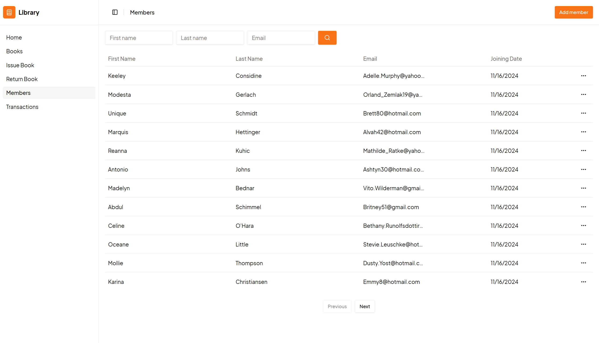
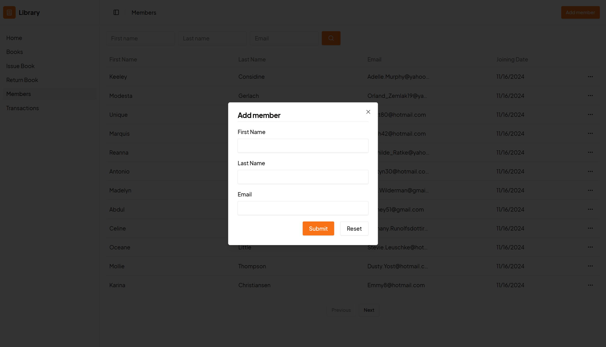
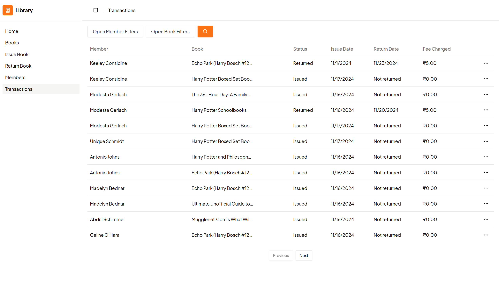

# Library Management

### Index

- [Project Structure](#project-structure)
- [Installation and development](#installation-and-development)
- [Screenshots](#screenshots)

### Tech Stack

- Vite
- React
- Typescript
- TailwindCSS
- Django (Rest Framework)
- Postgres

### Project Structure

The project is structured as follows:

```bash
.
├── apps
│   ├── api            # Backend app
│   └── web	           # Web app
```

### Installation and development

Run this commands at the root of the project

#### Installation

```bash
pnpm install
```

#### Environment Variables

Copy the `.env.example` file from respective apps to `.env`

#### Development

```bash
pnpm dev
```

### Screenshots

Homepage


Books


Add Books


Import Books


Issue Books


Return Books


Members


Add Members


Transactions

